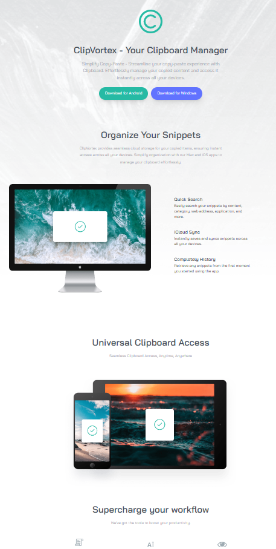

# ClipVortex - Clipboard Website Template

ClipVortex is a simple website template for a clipboard manager. It provides a user-friendly and modern interface for managing your clipboard snippets. This template is suitable for developers looking to create their own clipboard manager website.

## Table of Contents

- [Live Demo](#live-demo)
- [Features](#features)
- [Getting Started](#getting-started)
- [Customization](#customization)
- [License](#license)

## Live Demo

Try ClipVortex right now! Play with the website template in your web browser by following this [Live Demo Link](https://hamzeh01.github.io/ClipVortex/).

## Features

1. **Clipboard Management**: Create a clipboard management website to store and organize your copied items.

2. **User-Friendly Design**: The template offers a clean and user-friendly design that's easy to navigate.

3. **Responsive**: The website is responsive and works well on various devices and screen sizes.

4. **Easy Customization**: You can easily customize the template to fit your preferences and branding.

## Getting Started

To use this website template, follow these steps:

1. **Clone the Repository**:

   - `git clone https://github.com/Hamzeh01/clipvortex.git`
   - `cd clipvortex`

2. **Open the Project**:

   - Open the `index.html` file in your web browser to see the template in action.

3. **Customize**:

   - Personalize the template by editing the HTML, CSS, and JavaScript files to match your project's requirements.

4. **Deploy**:

   - Deploy the website on your preferred hosting platform or web server to make it accessible to others.

## Customization

You can customize this template in various ways:

1. **Styling**: Modify the CSS in the `style.css` file to change the look and feel of your website.

2. **Content**: Edit the HTML in `index.html` to add your own content and branding elements.

3. **Functionality**: Extend the functionality using JavaScript or integrate with back-end services as needed.

## License

This project is licensed under the MIT License - see the [LICENSE](LICENSE) file for details.

---

Feel free to explore and customize the ClipVortex template to create your own clipboard manager website. If you have any questions or need further assistance, please don't hesitate to [open an issue](https://github.com/Hamzeh01/clipvortex/issues).
